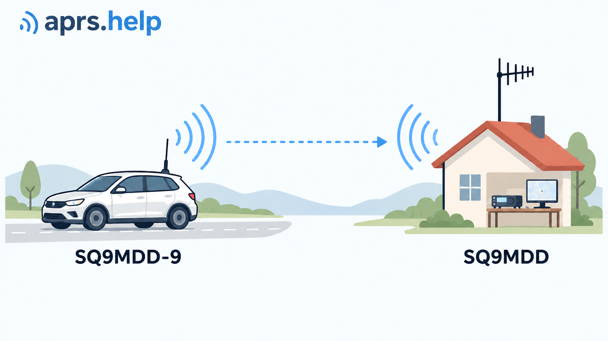
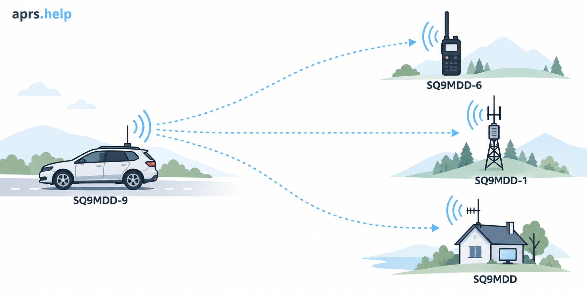
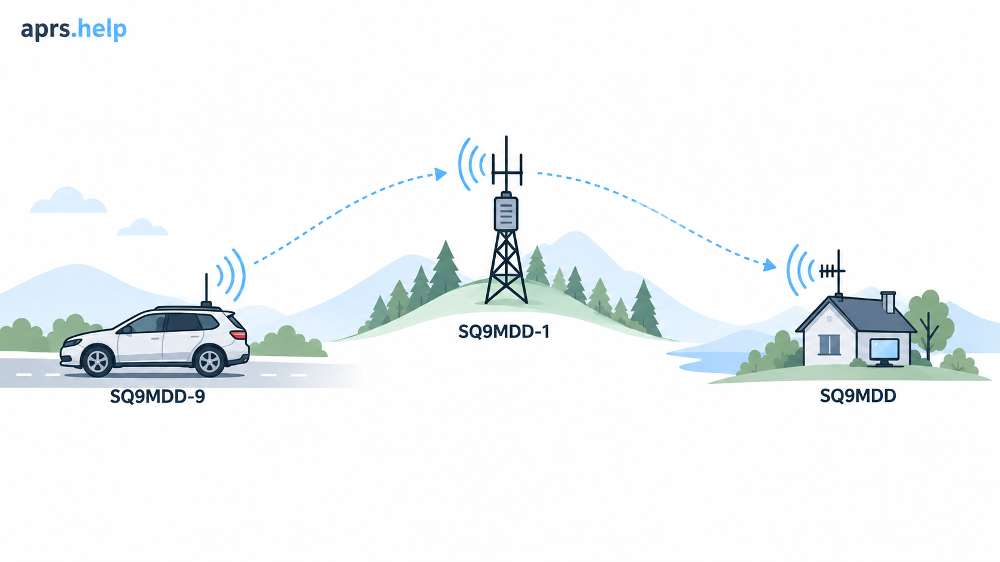
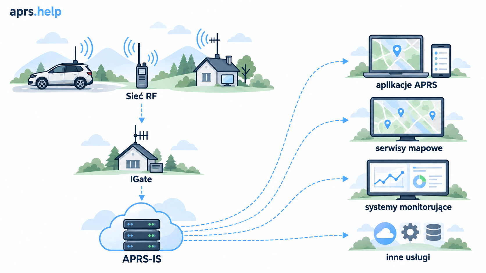
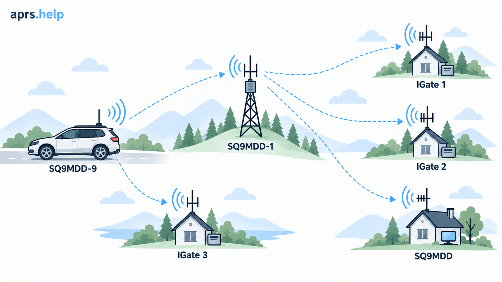
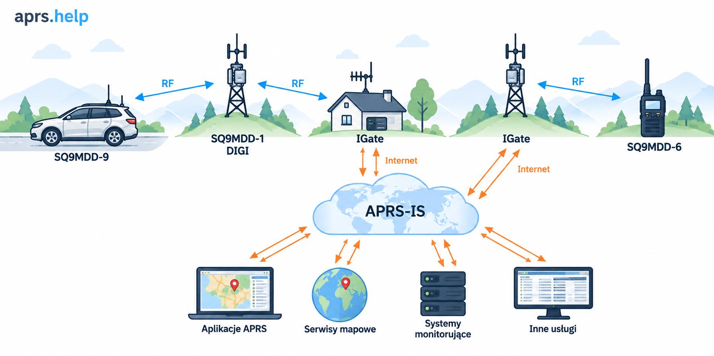

APRS es una red de difusión. Una estación transmite un paquete por radio y cada receptor dentro de su alcance puede recibirlo y utilizarlo de forma independiente. No hay un nodo central ni una ruta obligatoria: un paquete puede permanecer local, ser retransmitido por un digipeater, llegar a Internet mediante un IGate o hacer varias de esas cosas a la vez.

## De estación a estación: APRS funciona por radio

El caso más sencillo no necesita Internet ni infraestructura. Una estación móvil transmite un paquete y una estación doméstica lo recibe directamente por RF.



El paquete recibido puede contener, por ejemplo, una posición, un estado, un mensaje, datos meteorológicos o telemetría. Si el receptor entiende su formato, la información resulta útil de inmediato. Es un intercambio APRS completo y plenamente operativo.

Por radio, los datos APRS suelen transportarse en una trama **AX.25 UI** (*Unnumbered Information*). Su representación textual puede tener este aspecto:

```text
SQ9MDD-7>APRS,WIDE1-1:!5012.34N/01956.78E>
```

El indicativo de origen, la dirección de destino, la ruta y el campo de información describen la trama y su contenido APRS. Los artículos siguientes explican la estructura del paquete; aquí importa qué sucede después de transmitirlo.

## Una transmisión, muchos receptores

RF es un medio compartido. La misma transmisión puede ser recibida simultáneamente por una estación de usuario, un digipeater y un IGate.



La recepción no crea una cola ni una cadena de reenvío. Cada receptor toma su propia decisión: muestra los datos, retransmite el paquete por radio o lo reenvía a APRS-IS. Por eso, en APRS son normales varias rutas para una misma información.

## Digipeater: ampliar la cobertura de RF

Un **digipeater** recibe un paquete de radio y, si su ruta y configuración lo permiten, lo transmite de nuevo. Así, la información puede llegar más allá del alcance directo de la estación de origen.



Un digipeater no debe repetirlo todo. Su decisión depende, entre otros factores, de las direcciones de la ruta, de la política local de operación de la red y de la protección contra duplicados. Se usan habitualmente rutas como `WIDE1-1` y `WIDE2-n`; su semántica y reglas de configuración se tratan por separado.

La función de un digipeater puede resumirse así:

```text
RF → RF
```

No implica automáticamente acceso a Internet.

## IGate y APRS-IS: el límite entre RF e Internet

Un **IGate** (*Internet Gateway*) escucha el tráfico local de RF y reenvía paquetes seleccionados a **APRS-IS**, la red global de servidores que distribuye datos APRS. De este modo, los paquetes recibidos localmente están disponibles para aplicaciones, mapas y servicios de monitorización.



La dirección principal de un IGate es:

```text
RF → APRS-IS
```

Un IGate puede funcionar sin digipeating y un digipeater sin IGate. Una misma estación puede, por supuesto, desempeñar ambas funciones, pero son tareas independientes:

| Elemento | Función | Dirección principal |
| --- | --- | --- |
| Digipeater | Amplía la cobertura de la red local de radio | `RF → RF` |
| IGate | Conecta la RF local con APRS-IS | `RF → APRS-IS` |
| APRS-IS | Distribuye paquetes por Internet | Internet |

APRS-IS amplía el alcance de la información, pero no sustituye el canal de radio. Un paquete que no aparezca en un servicio de Internet puede haberse recibido y utilizado correctamente de forma local.

## Por qué la misma trama aparece varias veces

En una red real, varios IGates pueden escuchar la transmisión original y su retransmisión. Cada uno puede reenviar la trama a APRS-IS.



No es un error de transmisión, sino una consecuencia de la naturaleza de difusión de RF. Los digipeaters, IGates y servidores APRS-IS reconocen duplicados para evitar propagar más la misma trama. Los detalles dependen de la implementación y configuración de cada nodo.

## De Internet de vuelta a la radio

La dirección `APRS-IS → RF` se limita deliberadamente. El canal de radio tiene poca capacidad y es compartido por todas las estaciones, por lo que un IGate no puede tratarlo como una copia completa de APRS-IS.

Un caso controlado típico es un mensaje dirigido a una estación local a la que el IGate ha escuchado recientemente por RF. Cuando se envía tráfico seleccionado desde APRS-IS a radio, puede emplearse el mecanismo **third-party traffic** para conservar la información sobre el origen del paquete. Las reglas de gating, los q-constructs y el formato third-party traffic requieren una explicación aparte.

## La imagen completa

El siguiente diagrama muestra estas funciones trabajando conjuntamente. La comunicación RF se distribuye localmente; los IGates mueven datos entre la radio local y APRS-IS; las aplicaciones y servicios utilizan los datos disponibles en Internet.



Para un paquete, pueden ocurrir en paralelo tres resultados:

- recepción local por otras estaciones,
- mayor cobertura gracias al digipeating,
- publicación en APRS-IS mediante uno o varios IGates.

Ninguno es necesario para que ocurran los demás. APRS local puede funcionar sin Internet, y un IGate puede reenviar un paquete a APRS-IS sin un digipeater.

## Puntos clave

- APRS no es una única ruta: `estación → digipeater → IGate → Internet`.
- Una transmisión RF puede ser útil para muchos receptores y llegarles por caminos diferentes.
- Un digipeater retransmite tráfico de radio; un IGate conecta RF con APRS-IS.
- Los duplicados son naturales en una red de difusión y sus componentes los filtran.
- Internet mejora la disponibilidad de los datos, pero no es condición para que APRS local funcione.
- El tráfico desde Internet a RF debe seleccionarse para no cargar el canal compartido.

## Siguiente paso

El siguiente paso es conocer la estructura de las tramas AX.25 y los paquetes APRS, las direcciones de origen y los SSID, el campo destination/TOCALL, las rutas de digipeater y las diferencias entre el tráfico RF y APRS-IS.
