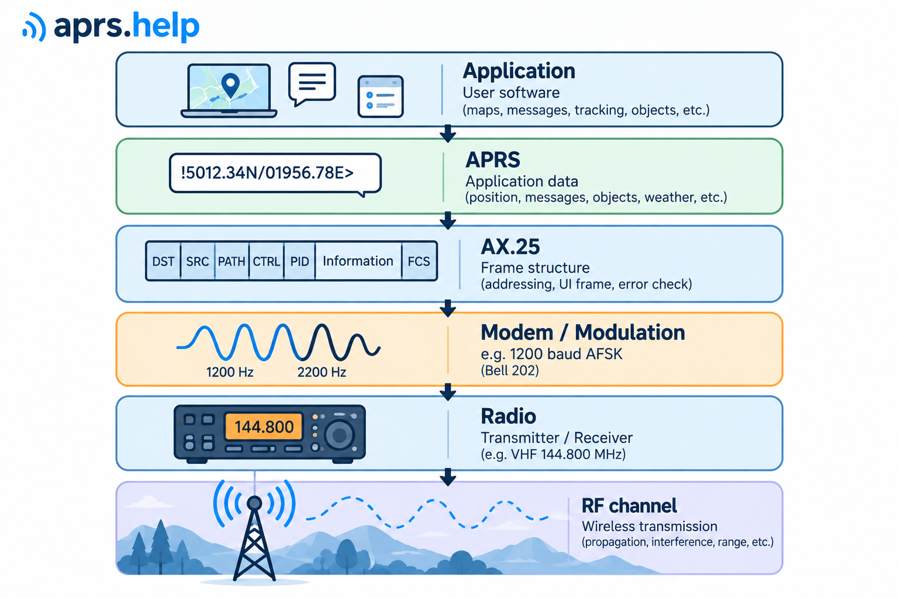
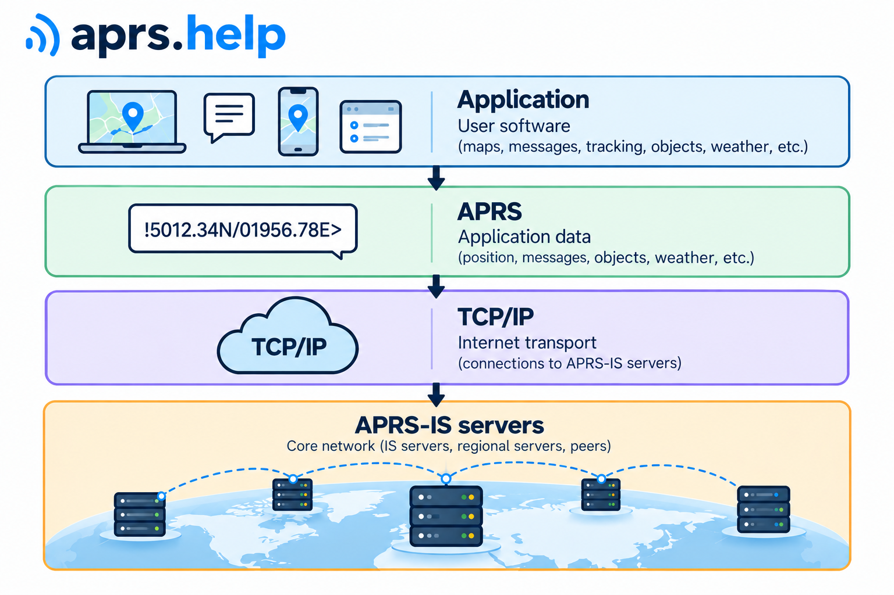

APRS define cómo se representan e interpretan los datos intercambiados entre estaciones, pero no define toda la cadena de transmisión. En una red de radio típica utiliza tramas AX.25, un módem y un transceptor. En Internet, la información APRS se transmite en formato de texto mediante APRS-IS, utilizando TCP/IP.

Los siguientes diagramas muestran una **división práctica de funciones**, no una correspondencia formal con el modelo OSI. Cada función puede realizarse mediante equipos separados o integrarse en un único transceptor o programa informático.

## Transmisión por radio



En la transmisión VHF convencional, la información preparada por la aplicación se coloca en una trama AX.25. El módem convierte los datos digitales en una señal adecuada para la cadena de radio y el transceptor la transmite en la frecuencia seleccionada.

### Aplicación de usuario

La aplicación crea la información destinada a transmitirse o interpreta los datos recibidos de otras estaciones. Puede gestionar informes de posición, mensajes, objetos, telemetría e información meteorológica. Puede ser un programa independiente o una función integrada en un transceptor o rastreador.

### Datos APRS

APRS define los formatos de información y las reglas para interpretarlos. Especifica, entre otras cosas, cómo codificar un informe de posición, un mensaje o datos de telemetría, y cómo identificar el tipo de información.

En una trama APRS típica, los datos principales se encuentran en el campo *Information* de la trama AX.25. Esto no significa que los demás campos carezcan de importancia para APRS. El protocolo también utiliza determinados elementos del direccionamiento AX.25, y el formato Mic-E codifica parte de la información en el campo de dirección de destino.

Por tanto, APRS y AX.25 cumplen funciones diferentes pero complementarias: AX.25 define la estructura de la trama de radio, mientras que APRS define cómo se representa e interpreta la información transportada y cómo se utilizan determinados campos de esa trama.

### AX.25

AX.25 es un protocolo de la capa de enlace de datos utilizado en packet radio. Define una trama que contiene, entre otros elementos, direcciones de origen y destino, una lista opcional de direcciones de digipeaters, un campo de control, un identificador de protocolo (PID), un campo *Information* y una secuencia de verificación de trama (FCS).

El tráfico APRS habitual utiliza tramas **UI** (*Unnumbered Information*), que no requieren establecer previamente una conexión AX.25. Así, una sola transmisión puede ser recibida por varias estaciones dentro del alcance. Sin embargo, transmitir una trama UI no garantiza la confirmación de su recepción. Las posibles confirmaciones de mensajes APRS constituyen un mecanismo independiente.

### Módem y modulación

El módem convierte los datos digitales en una señal adecuada para la cadena de transmisión y recepción, y realiza la operación inversa al recibir. En el APRS VHF convencional se utiliza habitualmente **AFSK 1200**, basado en Bell 202, con una velocidad de 1200 bit/s y tonos de audio de 1200 y 2200 Hz.

El módem puede ser un dispositivo independiente, formar parte de un TNC, estar integrado en un transceptor o ser un programa que utiliza una tarjeta de sonido. AFSK es una forma de transmitir tramas, no un formato de datos APRS.

### Radio y canal RF

El transceptor transmite y recibe la señal de radio. El canal RF es un medio compartido por las estaciones que operan en una frecuencia determinada. La eficacia de la transmisión depende, entre otros factores, de las antenas, la potencia de transmisión, la propagación, las interferencias y la ocupación del canal.

En las redes APRS VHF europeas se utiliza habitualmente la frecuencia **144,800 MHz**, pero ni esta frecuencia ni AFSK 1200 definen el propio APRS. La información APRS también puede transmitirse mediante otros métodos y en otras bandas.

## Cómo colaboran las capas: ejemplo de paquete

En registros y aplicaciones, un paquete APRS suele mostrarse mediante una representación de texto legible:

```text
SQ9MDD-7>APRS,WIDE1-1:!5012.34N/01956.78E>
```

En esta representación:

| Elemento | Significado |
| --- | --- |
| `SQ9MDD-7` | Dirección de origen AX.25. |
| `APRS` | Dirección de destino AX.25, utilizada aquí según las convenciones APRS y no como dirección de un destinatario concreto. |
| `WIDE1-1` | Elemento de la ruta de digipeaters almacenada en los campos de dirección AX.25. |
| `:` | Separador entre la cabecera y el campo de información en la representación de texto. |
| `!5012.34N/01956.78E>` | Contenido del campo *Information*: un informe de posición APRS sin comprimir. El signo `!` es el identificador de tipo de datos y el `>` final indica el símbolo de la estación. |

Este ejemplo muestra por qué no debe confundirse toda la representación visible con el campo de datos APRS. La cabecera utiliza campos AX.25 a los que APRS puede asignar un significado adicional, mientras que el campo *Information* contiene datos codificados en formato APRS.

**La representación de texto no es una copia literal de la trama transmitida por radio.** La trama AX.25 real contiene además campos codificados en binario que no aparecen arriba, incluidos el campo de control, el PID y el FCS. El separador `:` pertenece a la representación de texto, no a la estructura de la trama de radio.

La estructura de la trama se explica con más detalle en [«Anatomía de un paquete APRS»](../03-packet-anatomy/).

## Transmisión por Internet



En Internet, la aplicación sigue creando o leyendo información APRS, pero su transmisión no necesita un módem de radio ni una trama AX.25 en la forma transmitida por RF. El cliente se comunica con los servidores **APRS-IS** mediante una conexión **TCP/IP**.

APRS-IS utiliza una representación de texto de los paquetes que incluye la cabecera y el campo de información. Los servidores APRS-IS reciben paquetes y los distribuyen a los clientes conectados correspondientes según las reglas de funcionamiento de la red, incluidos los filtros aplicados.

**APRS-IS no es un túnel de Internet que transporte tramas AX.25 sin procesar.** Permite distribuir la información APRS mediante otro mecanismo de transmisión. Los servidores APRS-IS son componentes de infraestructura, no una capa independiente del modelo OSI.

## IGate: conexión entre ambos entornos

Un IGate conecta la red de radio con APRS-IS. Tras recibir un paquete por RF, puede reenviarlo a la red de Internet en la representación de texto adecuada. Durante ese proceso se puede añadir información específica de APRS-IS, por ejemplo, un *q-construct*. Esto no significa que estuviera presente en la trama original transmitida por la estación de radio.

El tráfico en sentido contrario está sujeto a reglas diferentes. Un IGate no debe tratar cualquier paquete recibido de APRS-IS como si fuera una trama lista para transmitirse directamente por RF. Las reglas detalladas de reenvío, incluido el uso del formato *third-party traffic*, corresponden a la descripción del funcionamiento de los IGate.

Esta distinción permite entender por qué un paquete visible en APRS-IS puede contener elementos adicionales que no estaban presentes en su transmisión por radio.

## Resumen

| Elemento | Función principal |
| --- | --- |
| Aplicación | Creación, recepción y presentación de información. |
| APRS | Formato e interpretación de la información, incluido el uso de determinados campos de dirección. |
| AX.25 | Estructura de la trama de radio, direccionamiento, ruta y detección de errores. |
| Módem | Conversión de datos digitales a la señal utilizada por un método de transmisión determinado y viceversa. |
| Radio y canal RF | Transmisión física de la señal entre estaciones. |
| APRS-IS | Intercambio y distribución por Internet de paquetes en representación de texto. |
| TCP/IP | Transporte de datos entre clientes y servidores APRS-IS. |
| IGate | Reenvío controlado de paquetes entre la red de radio y APRS-IS. |

La distinción fundamental está entre el **significado de la información** y **la forma en que se transporta**. APRS define el significado de los datos utilizando determinados mecanismos de AX.25. Por radio, la información se transporta en tramas AX.25; en APRS-IS, se distribuye en representación de texto mediante TCP/IP.

## Fuentes

- [*APRS Protocol Reference*, versión 1.0.1](https://www.aprs.org/doc/APRS101.PDF), capítulos 3–5: utilización de AX.25 y formatos de datos APRS.
- [*AX.25 Link Access Protocol for Amateur Packet Radio*, versión 2.2](https://tarpn.net/t/faq/files/AX25.2.2-Sep%2017-1-10Sep17.pdf): estructura de la trama y tramas UI.
- [*Connecting to APRS-IS*](https://www.aprs-is.net/connecting.aspx) y [*Server Design*](https://www.aprs-is.net/ServerDesign.aspx): conexiones de clientes, representación de texto y distribución de paquetes.
