An APRS symbol is not merely a picture marking a position on a map. It is also **a compact carrier of information about a station's or object's type, function, and properties**. A suitable symbol can identify a vehicle, a digipeater, or a home station, while an overlay can specify, for instance, its power source, the device's capabilities, or the type of field activity.

APRS transmits **the symbol code, not its graphic**. In typical position reports, two characters suffice: a table identifier and a symbol character. An overlay does not add a third character; it takes the place of the alternate-table identifier. The receiving application interprets the combination using its own symbol table. This conveys additional information without adding another character to the report.

## Encoding a symbol in a position report

In an uncompressed position report, the table identifier immediately follows the latitude and the symbol character immediately follows the longitude:

```text
SQ9MDD>APRS:!5003.50N/01956.00E>
                     ^         ^
                     |         |
                   table     symbol
```

The pair `/>` identifies a car: `/` selects the primary table and `>` selects the symbol in that table. This line is a textual representation of a packet, not a record of every byte in the radio AX.25 frame.

| Element | Role |
|---|---|
| **Table character** | Selects the primary table, alternate table, or an alternate symbol variant with an overlay. |
| **Symbol character** | Identifies a position in the selected table and, together with any overlay, determines the code's meaning. |
| **Graphic** | Stored or generated by the receiving application; it is not transmitted in the packet. |

Symbols also occur in other position-report formats, including compressed position and Mic-E. Their placement and encoding may differ, but they still identify a symbol rather than transmit a bitmap.

## Primary and alternate tables

The two APRS tables contain 94 entries each:

- `/` selects the **primary table**, used, among other things, for common stations and vehicles;
- `\` selects the **alternate table**, which also includes families of symbols extended with overlays.

Both characters are needed to determine the meaning. For example, `/>` is a car from the primary table, whereas `\>` is the base vehicle symbol from the alternate table. Likewise, `/-` is the primary-table house, while `\-` is an alternate symbol whose overlays can describe a home station's characteristics.

## Overlays and additional meaning

An **overlay** is a letter `A`-`Z` or a digit `0`-`9` that **replaces the `\` character** in an alternate symbol code. It is not an additional field and does not make the two-character symbol code longer.

```text
Alternate table:       \-    house (base symbol)
With S overlay:        S-    house, solar powered

                       ^
                       overlay instead of table character
```

The base symbol establishes the category; an overlay may identify a specific variant. Its meaning **depends on the symbol character**: `S-` refers to a house's power source, `S;` identifies SOTA activity, and `S#` describes a digipeater function. There is no universal dictionary in which a given letter means the same thing on every icon.

The 2007 extension provides for overlays on all alternate symbols, but **not every combination has an assigned meaning**. Do not invent interpretations or assume that other applications will recognize an undefined combination. The mechanism offers many possible combinations, but their usefulness depends on agreed definitions and software support.

Originally, an overlay was intended as a digit or letter superimposed on a base icon. The documentation also permits a completely different graphic for a specific combination if that conveys its meaning more clearly.

## Practical uses of symbols and overlays

### Home station: power source and operator presence

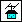

The `\-` alternate-house family is a clear example of how an icon can convey more than the object's basic type. According to the supplied overlay list, the following combinations are available:

| Code | Meaning |
|---|---|
| `\-` | House, alternate base symbol; historically used for an HF station. |
| `B-` | Battery-powered or operating off the electrical grid. |
| `C-` | Combined alternative energy sources. |
| `E-` | Emergency power in case of mains power failure. |
| `G-` | Geothermal energy. |
| `H-` | Hydropower. |
| `S-` | Solar power. |
| `W-` | Wind power. |
| `O-` | Operator present at the station. |
| `5-`, `6-` | Mains frequency unusual for the local area: 50 or 60 Hz, respectively. |

Example position report from a home station using the `S` overlay:

```text
SQ9MDD>APRS:!5003.50NS01956.00E-
```

Here, `S` immediately after the latitude replaces `\`, while the final `-` selects the house symbol. **The two characters `S-` are enough to declare solar power.** This is not another field, an extension to the comment, or a third symbol character.

This is a declaration of the station's characteristics, not a live measurement. `E-` does not prove that emergency power is currently running; similarly, `S-` is not power-generation telemetry. A symbol code can carry only one overlay. If multiple characteristics matter, use a comment, telemetry, or another appropriate APRS mechanism.

**Historical note:** older lists used `C-` for an amateur radio club. In the supplied 2017 revision of `symbols-new.txt`, `C-` instead denotes combined alternative energy sources and **the amateur radio club moved to `Ch`** (the `\h` building family). Keep this change in mind when comparing older applications and tables.

### Digipeater: functional information


A digipeater overlay can identify its function rather than merely the device type:

| Code | Meaning according to the extension list |
|---|---|
| `/#` | Generic digipeater symbol from the primary table. |
| `1#` | WIDE1-1 digipeater. |
| `A#` | Digipeater with an alternate input, for example on a different frequency. |
| `E#` | Digipeater with emergency power. |
| `I#` | Digipeater also equipped with IGate functionality. |
| `V#` | Digipeater using the Viscous mechanism. |

`I#` does not mean the same thing as the standalone APRS-IS gateway symbol. The first identifies a digipeater with an additional function, while the second belongs to a separate gateway-symbol family. The choice depends on which function you want to emphasize on the map.

### IGate: direction and method of forwarding

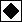

The `\&` family can indicate a gateway's functionality:

| Code | Meaning |
|---|---|
| `I&` | Generic IGate; the documentation recommends a more specific overlay where possible. |
| `R&` | Receive-only IGate on RF, without forwarding messages back to RF. |
| `T&` | Transmitting IGate with message paths limited to one hop. |
| `2&` | Transmitting IGate with two-hop message paths; the list notes that this is generally discouraged. |

The icon can therefore distinguish a receiving station from a gateway that also forwards messages onto RF. However, the symbol describes declared functionality; it does not confirm the current APRS-IS connection state or verify the configuration.

### Field activities and events

Different overlays in the portable-operation family identify different kinds of activity:

| Code | Meaning |
|---|---|
| `/;` | Basic portable-operation / campsite symbol. |
| `F;` | Field Day. |
| `I;` | IOTA (*Islands on the Air*). |
| `S;` | SOTA (*Summits on the Air*). |
| `W;` | WOTA (*Wainwrights on the Air*). |

This shows overlays conveying information unrelated to equipment or power. The same base icon can indicate the activity in which a station is participating.

### Vehicles and special facilities

The `\>` vehicle family includes `B>` for a battery-powered vehicle, `P>` for a plug-in hybrid, and `S>` for a solar-powered vehicle. In the `\z` shelter family, `Ez` indicates a facility with emergency power and `Tz` a medical triage point. These examples encode a particular property or function without expanding the symbol representation.

Choose a symbol that reflects the object's real role. Do not use symbols for emergency services, incidents, or hazards solely because of how they look.

## Choosing and interpreting symbols

A symbol should primarily reflect **the current role of the station or object**. Common choices include `/[` for a person on foot, `/>` for a car, `/b` for a bicycle, `/-` for a home station, `/#` for a digipeater, `/r` for a repeater, and `/_` for a weather station. Use an overlay for added detail only when the combination has a documented meaning.

To read an uncompressed position report, find the table character immediately after the latitude and the symbol character after the longitude. Then interpret **the two characters as one code**. For example, `!5003.50N/01956.00E>` contains the car symbol `/>`, while `!5003.50NS01956.00E-` contains `S-`, indicating a solar-powered home station.

Distinguish the symbol from the report's other data. It denotes an object's category or property, but it does not replace the comment, telemetry, or information about its actual state. If a property matters operationally, users whose software does not support the latest overlays should still be able to understand it.

## Why the same symbol may look different

Symbol graphics are stored or generated locally by each application. A client with an older table might show a new combination using just its base icon, omit the overlaid letter, or render it differently from a modern client. Fully compatible programs may also use different visual styles while retaining the same code meaning.

The extension documentation stresses compatibility: frequent changes to symbol meanings and missing overlay support can lead to different interpretations of the same packet. Applications should therefore **retain both received symbol characters**, even if they cannot yet render the combination. An unknown overlay should not cause a valid position report to be rejected.

Do not rely solely on an unusual icon in operational use. Important details, such as the object's role, frequency, or service availability, can also be provided in a suitable APRS comment.

## Complete symbol table

The following list covers all 188 entries in the supplied tables: 94 primary and 94 alternate symbols. Rows are paired by symbol character. The graphics come from the local `_img/verG` set and represent base symbols, not every possible overlay variant.

**Legend:** “available” means an entry not assigned in the cited list. “Overlay base” indicates a symbol whose meaning can be further specified with a letter or digit.

| Primary code | Icon | Meaning | Alternate code | Icon | Meaning |
|---|:---:|---|---|:---:|---|
| `/!` | 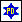 | Police / sheriff. | `\!` | 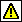 | Emergency alarm; overlay base. |
| `/"` |  | Reserved (formerly rain). | `\"` |  | Reserved. |
| `/#` | 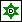 | Digipeater. | `\#` |  | Digipeater with overlay / green star. |
| `/$` |  | Telephone. | `\$` |  | Bank or ATM. |
| `/%` |  | DX Cluster. | `\%` |  | Power plant; overlay base. |
| `/&` |  | HF gateway. | `\&` |  | Gateway; IGate overlays. |
| `/'` |  | Small aircraft. | `\'` |  | Crash / incident site. |
| `/(` | 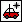 | Mobile satellite station. | `\(` | 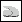 | Cloud cover; base for cloud variants. |
| `/)` |  | Wheelchair. | `\)` | 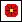 | Firenet MEO / MODIS Earth observation. |
| `/*` | 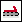 | Snowmobile. | `\*` | 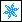 | Available. |
| `/+` |  | Red Cross. | `\+` |  | Church. |
| `/,` | 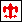 | Boy Scouts. | `\,` |  | Girl Scouts. |
| `/-` | 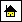 | House / VHF QTH. | `\-` |  | House (historically an HF station); overlay family base, including `O-` for operator present. |
| `/.` | 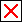 | X mark. | `\.` |  | Ambiguous position (large question mark). |
| `//` |  | Red dot. | `\/` |  | Destination point / waypoint. |
| `/0` | 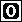 | Circle, obsolete symbol. | `\0` | 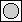 | Circle; IRLP, EchoLink, WiRES, and overlays. |
| `/1` |  | Available / historically a numbered circle. | `\1` |  | Available. |
| `/2` | 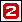 | Available / historically a numbered circle. | `\2` |  | Available. |
| `/3` |  | Available / historically a numbered circle. | `\3` |  | Available. |
| `/4` | 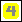 | Available / historically a numbered circle. | `\4` |  | Available. |
| `/5` |  | Available / historically a numbered circle. | `\5` |  | Available. |
| `/6` | 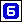 | Available / historically a numbered circle. | `\6` |  | Available. |
| `/7` |  | Available / historically a numbered circle. | `\7` |  | Available. |
| `/8` |  | Available / historically a numbered circle. | `\8` |  | Network node using 802.11 or another network. |
| `/9` | 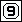 | Available / historically a numbered circle. | `\9` | 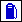 | Fuel station. |
| `/:` | 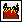 | Fire. | `\:` | 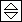 | Available (hail moved to overlays). |
| `/;` | 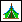 | Campsite / portable operation. | `\;` | 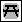 | Park or picnic area; supports event overlays. |
| `/<` | 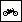 | Motorcycle. | `\<` | 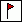 | Advisory / single weather flag. |
| `/=` | 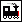 | Locomotive. | `\=` |  | Unassigned overlay symbol family. |
| `/>` | 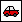 | Car. | `\>` | 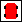 | Vehicle; overlay base. |
| `/?` | 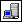 | File server. | `\?` |  | Information kiosk. |
| `/@` |  | Predicted position point (H/C). | `\@` | 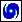 | Hurricane / tropical storm. |
| `/A` |  | Aid station. | `\A` | 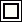 | Box; DTMF, RFID, XO, and other overlays. |
| `/B` |  | BBS / PBBS. | `\B` | 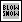 | Available (blowing snow moved to an overlay). |
| `/C` | 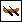 | Canoe. | `\C` |  | Coast Guard. |
| `/D` |  | Available. | `\D` | 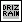 | Depot; overlay base. |
| `/E` | 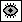 | Eye symbol; event or attention marker. | `\E` | 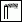 | Smoke and other visibility codes. |
| `/F` | 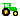 | Agricultural vehicle / tractor. | `\F` | 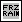 | Available (freezing rain moved to an overlay). |
| `/G` | 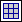 | Six-character Maidenhead locator. | `\G` | 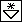 | Available (snow showers moved to an overlay). |
| `/H` |  | Hotel. | `\H` | 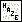 | Haze; also a base for hazard symbols. |
| `/I` |  | TCP/IP station on the radio network. | `\I` | 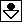 | Rain showers. |
| `/J` |  | Available. | `\J` | 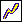 | Available (lightning moved to an overlay). |
| `/K` | 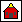 | School. | `\K` | 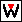 | Kenwood radio. |
| `/L` | 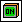 | Computer user connected to APRS. | `\L` | 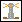 | Lighthouse. |
| `/M` |  | MacAPRS. | `\M` |  | MARS; service-type overlays. |
| `/N` | 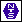 | National Traffic System station. | `\N` | 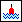 | Navigation buoy. |
| `/O` |  | Balloon. | `\O` |  | Amateur rocket / overlay balloon family. |
| `/P` |  | Police. | `\P` |  | Parking. |
| `/Q` |  | Available. | `\Q` |  | Earthquake. |
| `/R` |  | Recreational vehicle / camper. | `\R` |  | Restaurant. |
| `/S` |  | Space shuttle. | `\S` |  | Satellite / PACSAT. |
| `/T` |  | SSTV. | `\T` |  | Thunderstorm. |
| `/U` |  | Bus. | `\U` |  | Sunny weather. |
| `/V` |  | ATV / quad bike. | `\V` |  | VORTAC navigation aid. |
| `/W` |  | National Weather Service station. | `\W` |  | NWS station with overlays. |
| `/X` |  | Helicopter. | `\X` |  | Pharmacy. |
| `/Y` |  | Sailing yacht. | `\Y` |  | Radios and APRS devices. |
| `/Z` |  | WinAPRS. | `\Z` |  | Available. |
| `/[` |  | Person / walking station. | `\[` |  | Wall cloud; also an overlaid person symbol. |
| `/\` |  | Triangle, radio direction finding. | `\\` |  | New GPS symbol with overlays. |
| `/]` |  | Post office / mail. | `\]` |  | Available. |
| `/^` |  | Large aircraft. | `\^` |  | Aviation; other aircraft types via overlays. |
| `/_` |  | Weather station. | `\_` |  | Weather station / green digi with overlay. |
| <code>/&#96;</code> |  | Dish antenna. | <code>&#92;&#96;</code> |  | Rain; precipitation types via overlays. |
| `/a` |  | Ambulance. | `\a` |  | ARRL, ARES, Winlink, D-STAR, and other overlays. |
| `/b` |  | Bicycle. | `\b` |  | Available (dust or sand moved to an overlay). |
| `/c` |  | Incident command post. | `\c` |  | Civil defense; RACES, SATERN, and other overlays. |
| `/d` |  | Fire department. | `\d` |  | DX spot by callsign. |
| `/e` |  | Horse / equestrian activity. | `\e` |  | Sleet. |
| `/f` |  | Fire truck. | `\f` |  | Funnel cloud. |
| `/g` |  | Glider. | `\g` |  | Gale flags. |
| `/h` |  | Hospital. | `\h` |  | Shop / amateur radio fair; `Ch` means amateur radio club. |
| `/i` |  | IOTA (Islands on the Air). | `\i` |  | Box / point of interest. |
| `/j` |  | Jeep. | `\j` |  | Roadworks. |
| `/k` |  | Truck. | `\k` |  | Special vehicle, SUV, ATV, or 4×4. |
| `/l` |  | Laptop. | `\l` |  | Area: rectangle, circle, line, or triangle. |
| `/m` |  | Mic-E repeater. | `\m` |  | Value signpost. |
| `/n` |  | Network node. | `\n` |  | Triangle with overlay. |
| `/o` |  | Emergency operations center (EOC). | `\o` |  | Small circle. |
| `/p` |  | ROVER / dog. | `\p` |  | Available (partly cloudy moved to an overlay). |
| `/q` |  | Maidenhead locator (128 m description). | `\q` |  | Available. |
| `/r` |  | Repeater. | `\r` |  | Restrooms. |
| `/s` |  | Powered boat / ship. | `\s` |  | Ship / boat with overlay. |
| `/t` |  | Truck stop. | `\t` |  | Tornado. |
| `/u` |  | 18-wheeler truck. | `\u` |  | Truck with overlay. |
| `/v` |  | Van. | `\v` |  | Van with overlay. |
| `/w` |  | Water station. | `\w` |  | Flood, avalanche, or landslide. |
| `/x` |  | xAPRS / Unix. | `\x` |  | Road accident or obstruction. |
| `/y` |  | Yagi antenna at QTH. | `\y` |  | Skywarn. |
| `/z` |  | Available. | `\z` |  | Shelter with overlay. |
| `/{` |  | Available. | `\{` |  | Available (fog moved to an overlay). |
| <code>/&#124;</code> |  | TNC stream switch. | <code>&#92;&#124;</code> |  | TNC stream switch. |
| `/}` |  | Available. | `\}` |  | Available. |
| `/~` |  | TNC stream switch. | `\~` |  | TNC stream switch. |

| Additional image file | Icon | Notes |
|---|:---:|---|
| `x.gif` |  | Additional copy of the Red Cross graphic; its primary-table symbol code is `/+`. |

## Sources and notes on the lists

- [APRS Symbols - master symbol list](http://www.aprs.org/symbols/symbolsX.txt) - primary and alternate tables, including marks for symbols extended with overlays.
- [APRS symbol overlays and extensions](http://www.aprs.org/symbols/symbols-new.txt) - examples and assigned overlay meanings for houses, digipeaters, IGates, vehicles, and other families.
- [Overlay Extension to APRS Symbol Set](http://www.aprs.org/symbols/symbols-overlays.txt) - rationale for extending the symbol set and the backward-compatibility assumptions.
- [Background on Updating APRS Symbols](http://www.aprs.org/symbols/symbols-background.txt) - how symbols are displayed and limitations of older software.

The complete table above lists **base symbols** and their descriptions as prepared for this article. Consult the extension list separately for overlay variants. When older tables disagree with later lists, check the revision date of the relevant definition, especially for codes whose meaning changed, such as `C-`.
